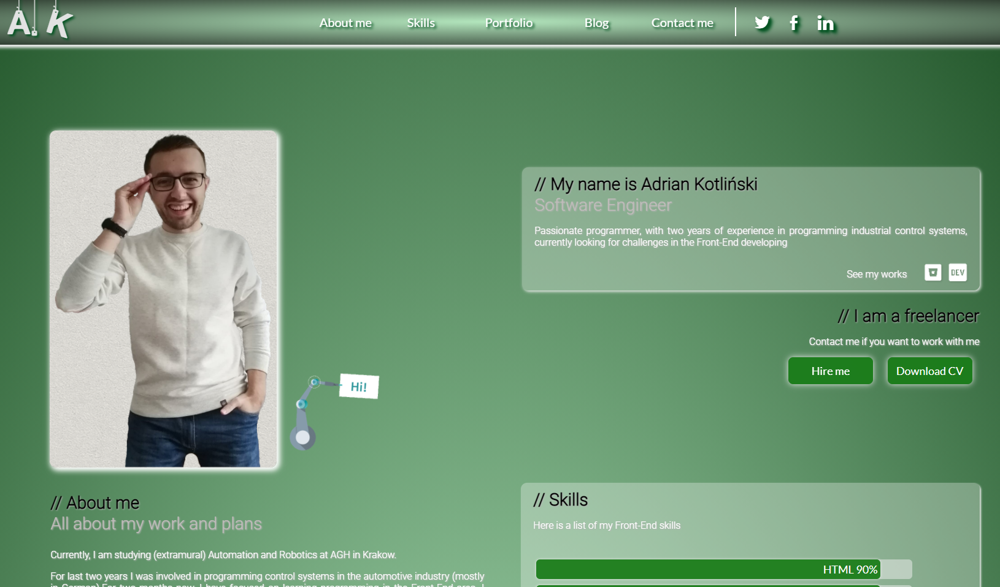

## CodersCamp 2020 - Projekt HTML & CSS

Hello, I would like to invite you to visit my portfolio page. Get to know me closer!

The website was originally prepared using JavaScript. These scripts have been removed for the purpose of this project.

The website consists of 5 main sections:
  * About me
  * Skills
  * Portfolio / my projects
  * Blog
  * Contact me
  
I've included links to social media on the website. I also attachted link to my CV.
---

## About my page

I'm 25 years old. I am a student of Automation and Robotics with 2 years of experience in programming in the automotive industry at the position of Automation Engineer.
The page includes a header with navigation that allows you to redirect to a specific section of the portfolio.

1. The "About me" section contains basic information about me and my hobbies.
2. The "skills" section contains a short summary of my technological stack (in the form of% knowledge of a given topic - it will be changed to a text description:
3. The "portfolio" section contains a list (short for now: D) of my projects. Projects have links to github and bitbucket, where the application code is.
4/ The "blog" section contains a short note about my previous professional work and a summary of my graduation from engineering studies.
5. The "contact" section contains a form that allows you to contact me via e-mail. I also put a contact phone number and a link to my website :)

---
## Contact with me

If you are interested in a contact, you can press the "Hire me" button which will redirect you to the contact form.
"Download CV" button will allow you to download my CV in PDF format.

---
## Follow me and 

Stay on top of my achievements. Below is a link to the demo version of the portfolio and a link to my website:
Github portfolio:
https://kotlinski95.github.io/myPortfolio
My website:
https://kotlinskidev.pl/
